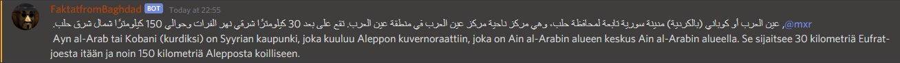

# FaktatfromBaghdad

### Delivering the facts

[Invite to your server](https://discord.com/api/oauth2/authorize?client_id=786280655239118868&permissions=2048&scope=bot)

## Running locally

`npm install`

#### configure .env
`TOKEN=<discord bot token>`  
`GOOGLE_APPLICATION_CREDENTIALS=<relative path to your google service api configuration file>`  
`CHANNEL_NAME=<name of the channel to restrict use into>`  

### Building docker and running image  

`docker build -t <give a name to the image>`  
`docker run -d --name <give a name to the container> --restart unless-stopped <name given to the image>`